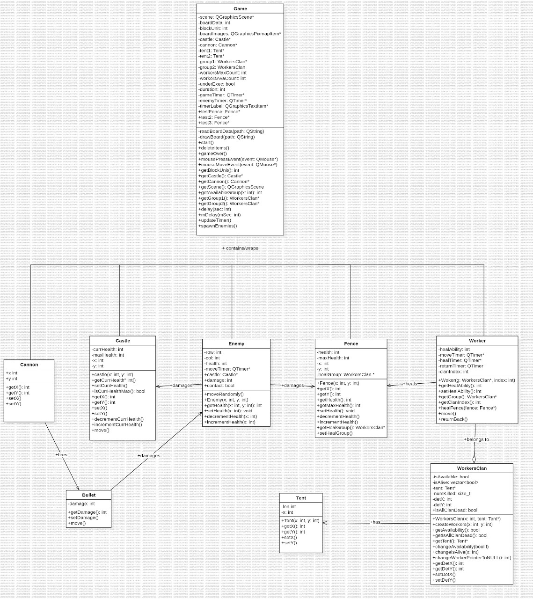

# Clash-of-Clans-QT: 

This project is a clone of the popular mobile game Clash of Clans, developed using the QT framework.

## Game Design and Code Hierarchy Features
**Castle & Fence:** 
* Share position data and health monitoring.
* Feature currHealth and maxHealth attributes.
* MaxHealth prevents health increments beyond the initial value.

**Cannon & Bullet:**
* Cannon firing handled in mousePressEvent function.

**Enemy:**
* Attributes for position and health.
* Movement based on Euclidean algorithm.
* Controls movement, collisions, and interactions.

**Citizen Workers:**
* Divided into two groups for fence healing.
* WorkersClan and Worker classes manage functionality.
* Movement and healing mechanisms with timers.
* Choice of worker group based on availability and proximity.
* Efficient memory usage by creating workers only when needed.
* Deletion and removal from scene to deallocate memory.

## UML Design



## Getting Started

**Prerequisites:**

* QT framework (version 5.15 or higher) installed (https://www.qt.io/download)
* C++ compiler (https://gcc.gnu.org/)
* OpenGL support (https://www.opengl.org/)

**Setup:**

1. Clone the repository:
```bash
git clone https://github.com/MohamESalem/Clash-of-Clans-QT.git
```
2. Open the project in QT Creator and build the project.

3. Run the game and enjoy!

## Usage

* Use the mouse to navigate the game world and interact with objects (buildings, troops).

## Contributing

We welcome contributions to this project! Please submit a pull request with your proposed changes. 
